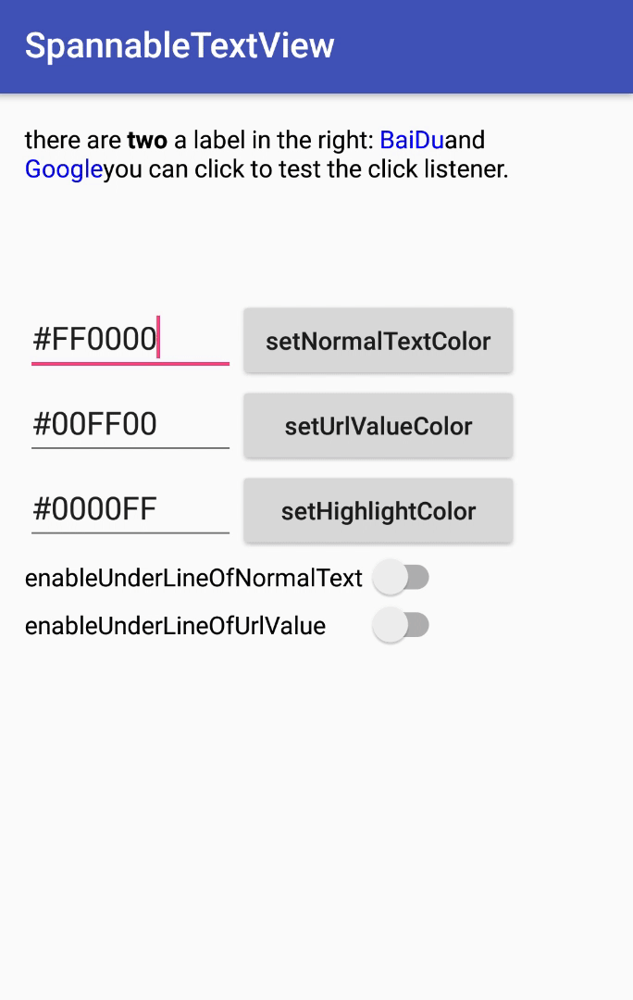

# UrlSpannableTextView
a simple custom TextView for dealing with url click event

# Sample
```xml
<com.zhuanghongji.urlspannabletextview.lib.UrlSpannableTextView
    android:id="@+id/spannableTextView"
    android:layout_width="wrap_content"
    android:layout_height="wrap_content"/>
```

```java
public static final String TEST_TEXT = "there are <b>two</b> a label in the right:"
    + " <a href=\"http://www.baidu.com\">BaiDu</a>"
    + " and"
    + " <a href=\"https://www.google.com\">Google</a>"
    + " you can click to test the click listener.";

tvUrlSpannable.setOnSpannableClickListener(
    new UrlSpannableTextView.OnSpannableClickListener() {
      @Override
      public void onNormalClick(View view, String text) {
          Toast.makeText(mContext, "onNormalClick text = " + text,
              Toast.LENGTH_SHORT).show();
      }

      @Override
      public void onUrlClick(View view, String value, String url) {
          Toast.makeText(mContext, "onUrlClick value = " + value + ", url = " + url,
              Toast.LENGTH_SHORT).show();
      }
});

tvUrlSpannable.setSpannableText(TEST_TEXT);
```


